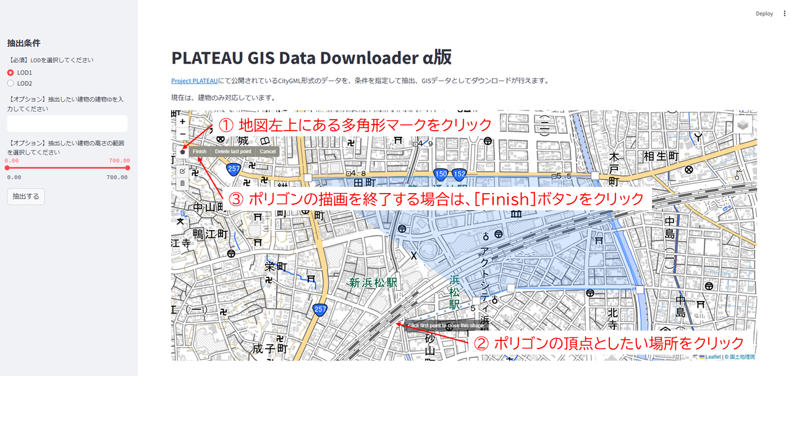
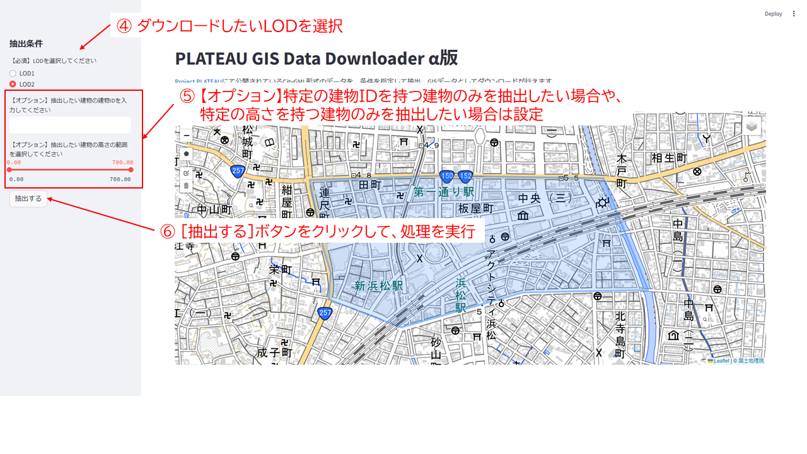
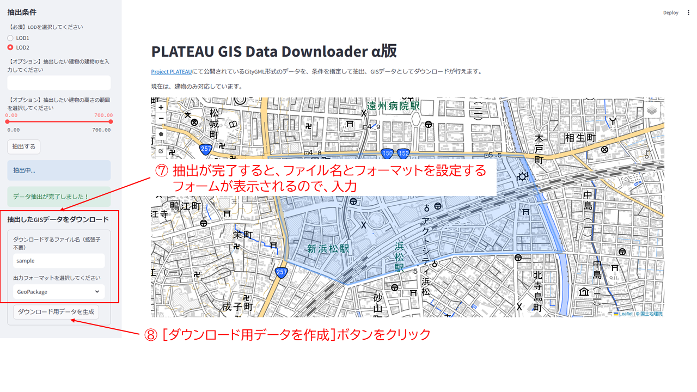
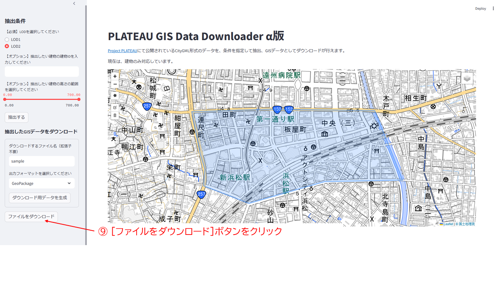

# PLATEAU GIS Data Downloader
[Project PLATEAU](https://www.mlit.go.jp/plateau/)にて公開されているCityGML形式のデータを、条件を指定して抽出、GISデータとしてダウンロードが行えるWebアプリケーションを目指しています。  
現在は、一部の建築物データのみ対応しています。  

https://github.com/user-attachments/assets/cbd95d39-5cf2-44ae-9a07-08b411f11620

---

## 機能
- Project PLATEAUで配布されているCityGMLデータをGeoPackageなどのGISで扱えるファイルフォーマットにへ変換して、以下の条件を満たすデータをダウンロード  
    - 範囲（必須）
        ユーザが描いたポリゴン範囲に含まれるデータのみをダウンロード  
    - 建物ID（オプション）  
        ユーザが欲しい特定の建物の建物IDのデータのみをダウンロード  
        特定の1つの建物をダウンロードするときを想定  
    - 高さ指定（オプション）  
        ユーザが欲しい建物の高さの範囲（最小値、最大値）内のデータのみをダウンロード     

<br/>

## 注意事項  
- __あくまで個人が趣味で開発したものです__  
- [G空間情報センターのページ](https://www.geospatial.jp/ckan/dataset/plateau)から配布されているすべてのCityGMLデータの仕様を満たすものではありません  
- このツールを利用したことによって生じたいかなる損害についても、ツール作成者は責任を負いかねます  
<br/>

## 使い方
### 環境構築
Python3（Python 3.11.11, WSL2上に作成したUbuntu20.04 LTSで動作確認）  
PythonからGDALを扱うため、AnacondaやMinicondaなどで環境構築することを想定しています。  
```shell
$ conda env create -n ${環境名} -f environment.yml
```

### 実行方法
以下のコマンドを実行し、ターミナル上に表示されたURLにWebブラウザにアクセス
```Shell
$ cd src
$ streamlit run app.py
```
### Webアプリケーションの使い方
1. ダウンロードしたい範囲のポリゴンを描く（必須）
    右側に地図上でダウンロードしたい範囲を表示し、地図左上にある多角形マークをクリックしポリゴンを描いてください。  
    ポリゴンを描く作業を終了するときは、左上に表示されている`Finish`ボタンをクリックしてください。  
    

2. サイドバーに表示されている抽出条件を設定し、`抽出する`ボタンをクリック
    LODの選択は必須、建物ID指定と高さ範囲の指定はオプションです。  
    

3. ダウンロードするときのファイル名とフォーマットを設定し、`ダウンロード用データを作成`をクリック
    

4. `ファイルをダウンロード`をクリックし、ファイルをダウンロード
    
<br/>

## ライセンスについて  
- [./data](./data)に格納されているデータ: [CC BY 4.0](https://creativecommons.org/licenses/by/4.0/)
- ソースコード: [MIT](https://opensource.org/license/mit/)
<br/>

## 使用しているデータの出典
[こちら](./data/README.md)をご覧ください。
<br/>

## 課題/今後の対応予定
- [ ] LOD0の建築物データの取得
- [ ] LOD1/LOD2でうまく表示されない建築物データの対応
- [ ] 建築物データ以外への対応
- [ ] Webアプリケーションとしての公開
- [ ] stliteなどを用いてデスクトップアプリ化  
